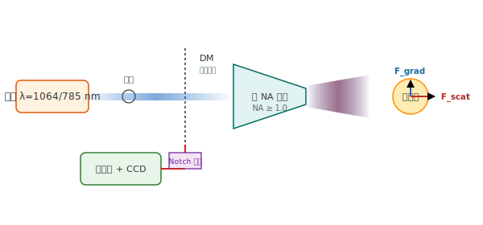
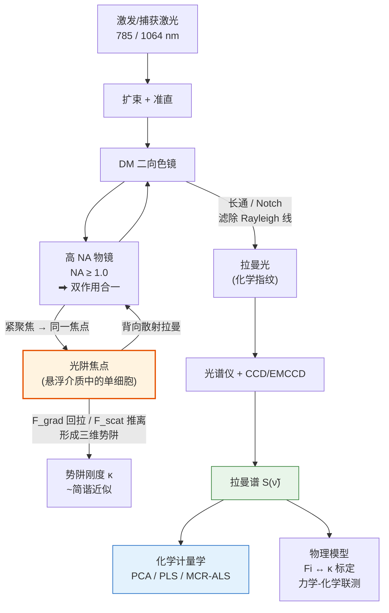
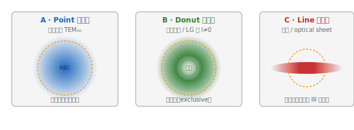

# 光镊拉曼光谱（LTRS）技术简报

## 目录

1.  [一句话定义](#1-一句话定义)
2.  [术语 / 名词表](#2-术语--名词表)
3.  [核心技术原理](#3-核心技术原理)
4.  [原理示意图](#4-原理示意图)
5.  [基本公式方程](#5-基本公式方程)
6.  [技术变体 / 发展：结构光光阱拉曼](#6-技术变体--发展结构光光阱拉曼)
7.  [数据处理算法](#7-数据处理算法)
8.  [典型示例应用](#8-典型示例应用)
9.  [注意事项与工程要点](#9-注意事项与工程要点)
10. [参考文献](#10-参考文献)
11. [依赖地图](#11-依赖地图)

---

## 1. 一句话定义

> **光镊拉曼光谱 (Laser Tweezers Raman Spectroscopy, LTRS)** = 单光束光镊**无接触捕获单个微粒 / 活细胞** + 拉曼光谱（Raman spectroscopy）**原位化学指纹探测**，二者共用同一台高数值孔径显微物镜集成于一体。
>
> **英文名**：Laser Tweezers Raman Spectroscopy（LTRS），别名 Raman Tweezers / Raman Tweezers Spectroscopy (RTS)。
>
> **典型应用场景**：活体单细胞（红细胞、酵母、癌细胞）化学指纹分析；亚细胞组分区隔探测；本简报触发文献为结构光光阱拉曼分类红细胞（Sarmah 2026, Anal. Chem.）。

---

## 2. 术语 / 名词表

### 2.1 专有名词 + 公式物理量符号

**专有名词（名称 / 缩写）**：

| 术语 | 简单释义 | 备注 |
| :-: | :-- | :-- |
| **LTRS** | Laser Tweezers Raman Spectroscopy | 中文：激光镊拉曼光谱 / 光镊拉曼光谱；详见 §3 / §3.2 |
| **光镊** | 利用激光梯度力无接触操控微观物体的技术 | 1986 年 Ashkin 提出；详见 §3.3 |
| **Raman 散射** | 光子与分子振动能级交换能量的非弹性散射 | 与 Rayleigh 散射区分；详见 §3.4 |
| **Rayleigh 散射** | 能量无衰减的弹性散射 | 强度约 Raman 的 $10^6$–$10^8$ 倍 |
| **TEM₀₀** | 横向电磁基模（高斯基模） | 经典 LTRS 的光场形式；详见 §6 |
| **LG 模** | Laguerre-Gaussian 模，涡旋光束 | 产生甜甜圈型光阱；详见 §6.3 |
| **Ashkin 判据** | 轴向梯度力 > 散射力是稳定单光束捕获的必要条件 | 1986 年提出；详见 §3.3 |
| **RBC** | Red Blood Cell，红细胞 | 本简报触发文献（Sarmah 2026）的样品 |
| **NA** | Numerical Aperture，数值孔径 | 表征物镜收光能力；LTRS 要求 NA ≥ 1.0 |

**公式物理量符号**：

| 符号 | 含义 | 数值 / 常用取值 | 首次正式定义 |
|:---:|:---|:---|:---|
| $\lambda_0$ | 激发激光波长 | 532 / 633 / 785 / 1064 nm | §5.3 |
| $\omega_0$ | 激发激光角频率 | $\omega_0 = 2\pi c / \lambda_0$ | §5.3 |
| $\omega_s$ | 散射光角频率 | $\omega_s = \omega_0 \mp \omega_\text{vib}$ | §5.3 |
| $\omega_\text{vib}$ | 分子振动角频率 | 决定 Raman shift | §5.3 |
| $\tilde\nu_\text{shift}$ | Raman shift（波数） | 200–3000 cm⁻¹（指纹区） | §5.3 |
| $N$ | 焦点体积内分子数 | 决定 Raman 信号强度 | §5.3 |
| $I$ | 光强 | W/m² | §5.1 |
| $a$ | 粒子半径 | 亚 μm 至数 μm | §5.1 |
| $n_p$ | 粒子折射率 | 聚苯乙烯 ≈ 1.59 | §5.1 |
| $n_m$ | 周围介质折射率 | 水 ≈ 1.33 | §5.1 |
| $m$ | 相对折射率 $n_p / n_m$ | 聚苯乙烯 / 水 ≈ 1.19 | §5.1 |
| $\alpha$ | 等效极化率（Clausius-Mossotti 形式） | 表征粒子对光的响应 | §5.1 |
| $\partial\alpha/\partial Q$ | 极化率对简正坐标的导数 | 拉曼活性选律判据 | §5.3 |
| $Q$ | 简正坐标 | 描述分子振动模式 | §5.3 |
| $\mathbf{F}_\text{grad}$ | 梯度力（指向光强最大处） | pN / W 量级 | §5.1 |
| $\mathbf{F}_\text{scat}$ | 散射力（沿光轴推开） | pN / W 量级 | §5.1 |
| $\kappa$ | 阱刚度（trap stiffness） | pN / nm 量级 | §5.2 |
| $\langle x^2 \rangle$ | 粒子位置均方位移 | ~ (50 nm)² | §5.2 |
| $k_B$ | Boltzmann 常数 | $1.381 \times 10^{-23}$ J/K | §5.2 |
| $T$ | 温度 | ~300 K | §5.2 |
| $\eta$ | 介质黏度 | 水 ≈ 1 mPa·s | §5.2 |
| $\gamma$ | Stokes 阻力系数 | $\gamma = 6\pi\eta a$ | §5.2 |
| $f_c$ | 功率谱转角频率 | 用于功率谱法标定 $\kappa$ | §5.2 |
| $l$ | 涡旋光束拓扑荷 | $l \neq 0$ 产生 donut | §6.3 |
| $p$ | 涡旋光束径向指数 | LG 模 $u_{p,l}$ 的 $p$ | §6.3 |
| $w$ | 光束束腰 | LG 模参数 | §6.3 |
| $L_z$ | 轨道角动量（每光子） | $L_z = l\hbar$ | §6.3 |

### 2.2 同义术语与别名

| 同义组 | 唯一用名 | 别名 |
|:---|:---|:---|
| **LTRS** | **LTRS**（英文缩写） | 激光镊拉曼光谱 / 光镊拉曼光谱 / Raman Tweezers / Raman Tweezers Spectroscopy (RTS) |
| **光镊** | **光镊** | 激光镊 / 光学陷阱 / optical tweezers |
| **Raman shift** | **Raman shift** | 拉曼位移 / 相对波数 |
| **Rayleigh 散射** | **Rayleigh 散射** | 瑞利散射 |
| **梯度力** | **梯度力**（叙述用） | gradient force / $F_\text{grad}$（公式符号） |
| **散射力** | **散射力**（叙述用） | scattering force / $F_\text{scat}$（公式符号） |
| **Stokes 散射** | **Stokes 散射** | 斯托克斯散射 |

### 2.3 意思相近术语 + 分类标准歧义术语

| 术语对 / 单术语 | 区分说明 / 分类标准 |
|:---|:---|
| **Stokes 散射 vs 反 Stokes 散射** | 意思相近术语（同源但有明确区别）：Stokes 散射光子能量**降低**（分子从光子获得振动能量）；反 Stokes 散射光子能量**升高**（分子把振动能量给光子）。两者在 LTRS 中都属拉曼散射通道。 |
| **Rayleigh 散射 vs Raman 散射** | 意思相近术语（同源但有明确区别）：Rayleigh 散射是**弹性**散射（无能量交换，光子频率不变）；Raman 散射是**非弹性**散射（能量交换 = 分子振动能级差）。Rayleigh 强度约为 Raman 的 $10^6$–$10^8$ 倍。 |
| **梯度力 vs 散射力** | 意思相近术语（都来自光-物质动量交换）：梯度力是**回复力**（指向光强最大处，捕获用）；散射力是**失稳力**（沿光轴推开粒子）。稳定单光束捕获需要梯度力 > 散射力（Ashkin 判据，详见 §3.3）。 |
| **光子**（分类标准歧义术语） | 按起源分类：γ 射线 / X 射线 / 紫外 / 可见 / 红外；按能量分类：> 100 keV 区间 γ / X 兼有 |

---

## 3. 核心技术原理

### 3.1 技术背景

> 📖 **前置概念：光为什么能"抓住"微粒**
>
> 可先把光镊理解成一个由光形成的"微型弹簧"。微粒使入射光发生折射，光的传播方向改变意味着光子动量改变；根据动量守恒，微粒会受到反作用力。在紧聚焦光束中，横向光强梯度产生指向焦点的**梯度力**，沿传播方向的动量传递产生把微粒推离焦点的**散射力**。只有回复性的梯度力足够强，微粒才会稳定停留在焦点附近；靠近平衡点时，这个光学势阱可近似为简谐势（详见 §3.3 与 §5）。

#### 双作用合一的好处

LTRS 想达成的成功路径：**同一束紧聚焦激光，在焦点处同时实现两件本应分开的事**——光镊捕获单细胞 + 拉曼散射光化学指纹探测，共用同一台高 NA 物镜。

**一句话好处**：研究者能在 **单细胞 / 单颗粒 / 原位 / 无接触** 的条件下，同时获得**力学信号**和**化学指纹**，且"测的就是同一个样品、同一时刻"——这是活细胞动力学、亚细胞分区、力学-化学联测等场景一直想要但做不到的事。

#### 传统方案为什么做不到

| 传统方案 | 局限 |
|:---|:---|
| 单独光镊测力学 + 单拉曼显微（两台仪器） | 两套样品准备流程，**无法保证测同一焦点** |
| 拉曼显微 + 载玻片固定 | 贴壁/固定改变细胞生理状态，**非原位** |
| 流式细胞 + 拉曼 | 细胞快速穿过激光束，滞留时间短、信号弱，无法研究同一细胞动力学 |
| 共聚焦拉曼 / 微流控 + 光谱 | 设备复杂，谱分辨率 vs 时间分辨率难以同时优化 |

**根本问题**：传统方案把"捕获"和"拉曼"分成两件事——要么不同焦点，要么不同时间，要么破坏细胞生理状态。**无法在同一时刻、同一样品、同一焦点上同时获得两套信号**。

#### LTRS 的解法

LTRS 把"光镊 + 拉曼"**合并到同一束光、同一个高 NA 物镜焦点**——靠的是两种物理效应在同一光场内的天然共存：

- **梯度力**（$\vec{F}_\text{grad}$）：光子被介质折射产生动量密度梯度 → 把粒子推向光强最大处 → **三维势阱** → 捕获
- **散射光**（含 Stokes / anti-Stokes 线）：光子与分子振动能级交换能量 → **化学指纹** → 拉曼

详见 §3.2 灵魂锚点的"双作用合一"拆解。

### 3.2 ★ 灵魂锚点：单光束内"双作用合一"

**LTRS 的精髓 = 同一束紧聚焦激光，在焦点处同时实现两件本应分开的事**：

| 在焦点的同一位置 | 来自光的何种物理效应 | 作用 | 是否可控 |
|---|---|---|---|
| **梯度力 `F_grad`**（指向光强最大处） | 入射光子被介质折射，**动量密度梯度**反向推粒子 | 三维势阱 → 捕获 | 由 NA / 功率 / 粒子–介质折射率差控制 |
| **散射光 `ν_s = ν_0 ± ν_vib`**（各向同性背散射） | 入射光子与分子振动能级交换能量 | 化学指纹 → 拉曼光谱 | 由功率 / 波长 / 积分时间控制 |

**关键推论**：因为这两件事**共享同一束光、同一焦点、同一积分时间**，所以"想要更纯的拉曼信号"和"想要更稳定的捕获"是**互相竞争的**——功率太高伤细胞，太低捕获与采谱都做不到信噪比要求。**这个 trade-off 是 LTRS 系统设计的根本张力**。

> ⚠️ **工程踩坑**：很多新手以为 LTRS 就是"单光镊 + 单拉曼仪"的简单叠加；真相是**捕获功率 ↔ 信号功率 ↔ 光损伤** 三股力同时拉扯同一束光，所有参数必须协同设计，不能调好一个再去调另一个。
>
> **结构化光场**（见 §6）的本质：**把"光束→粒子"和"光束→散射信号"这两条因果链在同一焦面上解耦开**——一份光场负责偏左偏右捕，一份单独配对 Raman 激发，做不做得到"分区探测"，决定了能不能"看膜 vs 看胞质"。

### 3.3 光镊捕获（Optical Trapping）

- 入射激光被高 NA 物镜（通常 NA ≥ 1.0，油浸/水浸）紧聚焦，在焦点附近形成极陡的光强梯度。
- 对折射率高于周围介质（`n_p > n_m`）的介电微粒，**梯度力指向光强最大处**（焦点），充当回复力。
- **散射力**沿光传播方向推动粒子，是失稳因素。
- 稳定单光束捕获的必要条件：轴向梯度力 > 散射力（**Ashkin 单光束梯度阱判据**，1986）。
- 平衡点附近势阱近似为**简谐势**，可用弹簧常数（trap stiffness）`κ` 描述。

### 3.4 拉曼探测（Raman Scattering）

- 绝大多数入射光子发生**Rayleigh 散射**（弹性散射，光子频率不变）；约 10⁻⁶–10⁻⁸ 的光子发生**非弹性散射**，损失/获得一份分子振动能量 → Stokes 散射 / 反 Stokes 散射线。
- Raman shift 只与分子振动模式有关，与激发波长无关 → 提供**结构/组分指纹**。
- 选律：只有**极化率随简正坐标变化**（`∂α/∂Q ≠ 0`）的振动模才有拉曼活性（与红外的偶极矩选律互补）。

### 3.5 联用配置（两种主流构型）

1. **单光束共焦式**：同一束激光既捕获又激发拉曼（最常见、最紧凑）。功率需折中——既要够强捕获，又要避免光损伤。
2. **多光束式**：一束（或两束）负责捕获/拉伸细胞，另一束独立负责拉曼激发。可解耦"捕获功率"与"激发功率"，并支持细胞拉伸等力学操作（见 §8）。

---

## 4. 原理示意图

### 4.1 经典 LTRS 光路

### 4.2 流程图（Mermaid：信号链路与控制回路）

### 4.3 三种光阱的焦面形态（Point / Donut / Line）

### 4.4 配套交互演示

🔗 直接打开：`交互演示.html`（浏览器双击即可，零依赖）

包含 4 个面板的交互演示：
- **(A) 受力分析**：Fgrad vs Fscat vs 功率 P，实时显示"当前判据满足度"
- **(B) 简谐势阱**：U(x) = ½κx² 与热分布 ⟨x²⟩ = kBT/κ
- **(C) 三种光场**：Point / Donut / Line 焦面形态 + 波长对 Rayleigh 焦斑的影响
- **(D) λ ↔ 拉曼信号 ↔ 光损伤**：直观展示 §3.1 中"三股力 trade-off"在工作窗上的体现

**可调参数**：功率、NA、粒子半径 a、波长 λ、几何形貌（5 个滑块）

**与本简报的 SVG 资源耦合**：
- `交互演示.html` 的 (C) 面板中三种光场形态的代码逻辑，可与外置 SVG `assets/trap-geometries.svg` 共享参数 → 后续优化时可让 demo 直接 `` 引用静态版本（按 skill §三·3.3 第 4 条规范"单一来源，单份维护"）

---

## 5. 基本公式方程

> ⚠️ 常数约定较多，下列力学公式以经典综述 **Svoboda & Block (1994)** 与 **Ashkin (1992)** 为准；**Rayleigh 区（粒径 `a ≪ λ`）适用**。真实活细胞尺度（μm 级）严格属**几何光学 / Mie 区**，Rayleigh 式仅作**机理与标度**理解，**不用于活细胞的定量力估算**。

### 5.1 光镊：梯度力与散射力（Rayleigh 区）

**相对折射率**：

$$m = \frac{n_p}{n_m}$$

**等效极化率**（Clausius–Mossotti 形式）：

$$\alpha = 4\pi \varepsilon_0\, n_m^2\, a^3 \cdot \frac{m^2-1}{m^2+2}$$

**梯度力**（回复力，正比于光强梯度）：

$$\mathbf{F}_\text{grad} \;=\; \frac{2\pi\, n_m\, a^3}{c}\left(\frac{m^2-1}{m^2+2}\right)\nabla I$$

**散射力**（沿光轴，正比于光强）：

$$\mathbf{F}_\text{scat} = \frac{n_m\, \sigma}{c}\, I,\qquad
\sigma = \frac{128\,\pi^5 a^6}{3\,\lambda^4}\left(\frac{m^2-1}{m^2+2}\right)^2$$

**稳定单光束捕获判据**（轴向）：

$$\boxed{F_\text{grad}^{(z)} > F_\text{scat}^{(z)}}$$

> **算例 + 适用条件**：取水浸物镜 NA=1.2、λ=1064 nm、聚苯乙烯小球 `a=2.5 μm`、`m=1.19`。代入上式可得典型 `F_grad ≈ 10 pN / W`、`F_scat ≈ 1 pN / W` 级别；梯度力为散射力的数十倍 → 满足 Ashkin 判据。**（定量数值参考来源待核实）**
>
> **适用条件**：粒径 `a ≪ λ`（Rayleigh 区）。活细胞（μm 级）严格属 Mie 区，**Rayleigh 式仅作机理与标度理解**，不用于活细胞定量力估算。

### 5.2 阱刚度与标定（简谐近似）

平衡点附近：

$$F = -\kappa\, x \quad(\text{简谐势})$$

- **能量均分法**标定阱刚度：

$$\tfrac{1}{2}\kappa\langle x^2\rangle = \tfrac{1}{2}k_B T
\;\Rightarrow\;
\boxed{\kappa = \frac{k_B T}{\langle x^2\rangle}}$$

- **功率谱法**（转角频率 corner frequency）：

$$f_c = \frac{\kappa}{2\pi\gamma},\qquad \gamma = 6\pi\eta a\ (\text{Stokes 阻力})$$

其中 `η` 为介质黏度，`a` 为粒子半径。

> **算例 + 适用条件**：`a = 2.5 μm` 聚苯乙烯小球在 `η_water ≈ 1 mPa·s`，`T = 300 K`，测得 `⟨x²⟩ ≈ (50 nm)²`：代入能量均分法得 `κ ≈ 1.6·10⁻⁶ N/m`，对水媒质典型量级（pN/nm）符合。**（定量数值参考来源待核实）**
>
> **适用条件**：简谐近似在线性回复力区间有效；偏离焦点过大或光场畸变显著时需数值或实验标定。

### 5.3 拉曼散射

**能量守恒**（Stokes / anti-Stokes）：

$$\hbar\omega_s = \hbar\omega_0 \mp \hbar\omega_\text{vib}
\quad\begin{cases}-：\text{Stokes（散射光能量降低）}\\+：\text{anti-Stokes}\end{cases}$$

**Raman shift（波数，实验常用）**：

$$\boxed{\Delta\tilde{\nu}\,[\text{cm}^{-1}] = \frac{1}{\lambda_0[\text{cm}]} - \frac{1}{\lambda_s[\text{cm}]}}$$

**散射强度标度**（`ν⁴` 律 + 极化率导数）：

$$I_\text{Raman} \;\propto\; (\omega_0 \pm \omega_\text{vib})^4\;\left|\frac{\partial \alpha}{\partial Q}\right|^2\, N\, I_\text{laser}$$

**拉曼活性选律**：

$$\left(\frac{\partial \alpha}{\partial Q}\right)_0 \neq 0$$

（`Q` 为简正坐标，`N` 为焦点体积内分子数，`α` 此处指分子极化率张量。）

> **算例 + 适用条件**：从 1064 nm 改到 785 nm 激发，频率提升 1.35 倍 ⇒ 拉曼散射截面 ∝ `ν⁴` 提升约 **3.3 倍**。这是为何教学/科研常用可见–近红外（532/633/785 nm）而非深红 1064 nm：信噪比改善，但要付出"荧光背景与光损伤加剧"的代价 —— 这又是 §3.2 中 trade-off 的具体体现。
>
> **适用条件**：ν⁴ 律在散射截面远小于入射时成立（绝大多数实验条件满足）；近共振 / 共振拉曼条件下需做共振修正。

---

## 6. 技术变体 / 发展：结构光光阱拉曼（Structured Optical Trap Raman）

### 6.1 经典 LTRS 的固有短板

经典 LTRS 用**高斯基模（TEM₀₀）点聚焦**，激发斑极小，只探到细胞**内部（主要是胞质 cytoplasm）**，**漏掉细胞膜**这一关键组分。对红细胞（RBC）而言，膜的力学/生化信息恰恰是病理诊断的核心。

### 6.2 解决思路：把激发/捕获光场"结构化"

用**结构光（structured light）**替换高斯点，改变焦点处光强的空间分布，从而**主动选择探测细胞的哪一部分**：

| 光阱类型 | 光场 | 焦斑形状 | 对细胞膜的探测特性 |
|---|---|---|---|
| **点聚焦 Point** | 高斯基模 TEM₀₀ | 极小点（见 `assets/trap-geometries.svg` A 面板） | 几乎只探胞质，**排斥膜**（经典 LTRS） |
| **甜甜圈 Donut** | 涡旋光束 / 拉盖尔-高斯 LG（`l≠0`） | 环形（轴上为暗核，见 SVG B 面板） | 膜信息**最专属**（most exclusive） |
| **线聚焦 Line** | 光片 / optical sheet | 线状（见 SVG C 面板） | 膜信息**最全包含**（most inclusive）；对 amide III 带尤敏感 |

> 这正是 §8 中 **Sarmah et al. (2026, Anal. Chem.)** 的核心方法学：在同一 LTRS 框架下并列比较 point / donut / line 三种光阱对 RBC 拉曼谱的贡献差异。

### 6.3 结构光相关公式

**涡旋光束 / 拉盖尔-高斯（LG）模**——螺旋相位造成轴上光强为零（甜甜圈）：

$$u_{p,l}(r,\phi,z) \;\propto\;
\left(\frac{r\sqrt{2}}{w}\right)^{|l|}
L_p^{|l|}\!\left(\frac{2r^2}{w^2}\right)
\exp\!\left(-\frac{r^2}{w^2}\right)
\underbrace{\exp(-i\,l\,\phi)}_{\text{螺旋相位}}$$

- 拓扑荷 `l ≠ 0` ⇒ 轴上（`r=0`）振幅为 0 ⇒ **环形（donut）光强分布**。
- `L_p^{|l|}` 为广义拉盖尔多项式，`w` 为束腰，`p` 为径向指数。

**轨道角动量（OAM）**——每个光子携带：

$$L_z = l\hbar \quad (\text{每光子})$$

**线聚焦（光片）**：近似非衍射贝塞尔型横向分布 `∝ J₀(k_r r)`，在一维方向拉长为线状激发区，从而在一次采集中覆盖细胞膜的更大弧段（"最全包含"的物理来源）。

> **算例 + 适用条件**：典型 LG₀₁（`p=0, l=1`）环宽 / 内径比由 `w` 和波长共同决定——可见–近红外波段环宽约 λ 量级。**适用条件**：高斯近似在 `r << w` 时成立；对大角度分量需考虑 `p` 阶项。

---

## 7. 数据处理算法

| 算法 | 原理 | 优势 | 适用场景 |
| :-: | :-- | :-- | :-- |
| **PCA** | 将高维拉曼谱向方差最大化方向投影，2–3 维可视化分类 | 无监督、可直接观察 point/donut/line 三类光阱的谱聚类 | Sarmah 2026 用于分类三种光阱的 RBC 谱 |
| **PLS 回归** | 潜变量回归 X（谱）→ y（含量/类别），适合浓度定量 | 处理高维共线性优于 OLS；可多组分同时预测 | 氧合度、膜蛋白含量定量 |
| **MCR-ALS** | 非负约束 + 交替最小二乘分解为基谱 × 浓度，保留物理可解释形态 | 给出"基谱"而非抽象潜变量，便于与标准谱对照 | 含膜组分的混合谱拆解 |
| **ANOVA** | 单/多因素方差分析，量化各组间统计显著性 | 检验 donut/line 是否真的"比 point 多挖出膜信号" | Sarmah 2026 用法 |

---

## 8. 典型示例应用

### 8.1 【本简报触发文献】结构光光阱拉曼分类 RBC

- **文献**：Sarmah, P.; Rastapur, V.; Khanna, R.; Bankapur, A. *Toward a Comprehensive Raman Analysis of Functional Cells With Structured Optical Traps.* **Anal. Chem. 2026, 98(17), 12925–12935.**
- **链接 / DOI**：<https://pubs.acs.org/doi/10.1021/acs.analchem.6c00651>（DOI: 10.1021/acs.analchem.6c00651，开放获取 CC-BY）

**★ 用到本技术 / 变体的具体位置**：
1. **经典 LTRS**：point focus trapping = 高斯点聚焦光镊 + 拉曼，探 RBC 胞质（本文的对照基准）。
2. **结构光发展 ①（Donut）**：涡旋光束产生环形光阱，专属探测细胞膜。
3. **结构光发展 ②（Line）**：光片产生线聚焦光阱，最全面覆盖细胞膜；发现 **1220–1290 cm⁻¹（amide III 带）** 信息尤为丰富。
4. **化学计量学**：**PCA** 对三类光阱的降维特征谱进行分类；**ANOVA** 定量确认 donut/line 光阱中"膜贡献"的统计显著性。

- **意义**：证明"选择光场结构 = 选择性探测细胞不同区域"，把经典 LTRS 从"只能看胞质"升级为"可分区看膜"。
- **可借鉴点（教学场景）**：用一片活的红细胞 + 手机显微镜头 + 三个不同焦面的拉曼谱，可作为物化实验课"光学-化学联合测量"教学案例。

### 8.2 经典 LTRS 在单细胞 / RBC 上的代表性应用

| 应用 | LTRS 发挥的作用 |
|---|---|
| **RBC 光损伤阈值** | ~2 mW 捕获 30 min 谱稳定；~20 mW 约 15 min 后谱剧变 → 界定安全功率窗口 |
| **血红蛋白氧合 / 脱氧** | 原位拉曼实时监测氧合标记带（如 ~1209 / 1222 cm⁻¹）随环境变化 |
| **力学-化学联测** | 双光阱拉伸 RBC + 第三束拉曼激发，首次直接测"光学力 ↔ 氧合"关系 |
| **血液病诊断** | 区分正常 vs 地中海贫血 / 疟疾感染 RBC；输血医学中监测储存损伤 |
| **真核单细胞分析** | 癌细胞、淋巴细胞、酵母（高渗胁迫）、线粒体/染色体等亚细胞组分 |

---

## 9. 注意事项与工程要点

### 9.1 缺点 / 弱项 / 不足 / 局限束缚

- **拉曼截面极小**：信号弱，积分时间通常为秒至分钟量级，难以兼顾快速动力学与高信噪比。
- **存在光损伤风险**：波长 / 功率需精细折中；近红外 785 / 1064 nm 常用于降低光损伤与荧光背景，但会牺牲拉曼强度。
- **荧光背景会干扰弱拉曼信号**：生物样品常需基线校正，且强背景可能掩盖细微组分差异。
- **定量力学模型存在尺度边界**：μm 级细胞属于 Mie 区，Rayleigh 公式只能用于机理理解，不能直接进行定量力估算（见 §5 警示）。

### 9.2 踩坑框

| # | 要点 | 说明 |
|:---:|:---|:---|
| 1 | **捕获 vs 激发功率 trade-off** | 同一束光要同时满足"捕得住"和"散射信号够"；典型 RBC 功率窗 2–20 mW |
| 2 | **波长选择** | 1064 nm：损伤小、荧光低，但 `ν⁴` 律致信号弱；785/633 nm：信号强、但荧光背景大；532 nm 几乎只在植物/无色素样品上用 |
| 3 | **物镜 NA** | 至少 1.0（油浸/水浸），NA 越高梯度力越陡，越稳 |
| 4 | **检测器** | EMCCD 适合弱信号（积分时间长）；科学级 CCD 是性价比主流 |
| 5 | **拉曼截面量级** | 仅 10⁻⁶–10⁻⁸ 的入射光子贡献拉曼 → 必须靠长积分 + 高 NA + 高功率密度 |
| 6 | **Rayleigh vs Mie 公式** | §5 的 Rayleigh 式严格适用于 `a ≪ λ`；活细胞（μm 级）属 Mie 区，**不能直接用 Rayleigh 公式做定量力估算** |
| 7 | **结构光的功率校准** | 多光阱结构（point+donut+line）需分别校准三路功率，否则类别间不可比 |

> ⚠️ **常见反模式**：
> - ❌ 把"捕获条件 + 拉曼条件"分开调好再叠加——三股作用共用同一束光，必须协同设计
> - ❌ 用活细胞做 Rayleigh 公式的定量力估算——已超出 Rayleigh 区边界
> - ❌ 比较 donut / line 光阱的拉曼谱强度时不校准三路功率——直接归因于"膜贡献"会造成错误解释

---

## 10. 参考文献

**经典文献（按时间正序）**：

1. Ashkin, A.; Dziedzic, J. M.; Bjorkholm, J. E.; Chu, S. *Observation of a single-beam gradient force optical trap for dielectric particles.* Opt. Lett. **1986**, 11(5), 288. DOI: 10.1364/OL.11.000288
2. Ashkin, A. *Acceleration and Trapping of Particles by Radiation Pressure.* Phys. Rev. Lett. **1970**, 24(4), 156. DOI: 10.1103/PhysRevLett.24.156
3. Svoboda, K.; Block, S. M. *Biological Applications of Optical Forces.* Annu. Rev. Biophys. Biomol. Struct. **1994**, 23, 247–285. DOI: 10.1146/annurev.bb.23.060194.001335 **（待核实）**

**综述**：

4. Redding, B.; Schwab, M. J.; Pan, Y.-L. *Raman Spectroscopy of Optically Trapped Single Biological Micro-Particles.* Sensors **2015**, 15(8), 19021–19046. DOI: 10.3390/s150819021
5. Snook, R. D.; Harvey, T. J.; Faria, E. C.; Gardner, P. *Raman tweezers and their application to the study of singly trapped eukaryotic cells.* Integr. Biol. **2009**, 1, 43–52. DOI: 10.1039/b815253e
6. Nelliat, M.; Mohan, G.; Lukose, J.; Shastry, S.; Chidangil, S. *Advancing Transfusion Medicine through Raman Tweezers Spectroscopy.* Transfus. Med. Hemother. **2024**. DOI: 10.1159/000538972
7. Zhu, T. 等（综述）. *Optical Tweezers in Studies of Red Blood Cells.* Cells **2020**, 9(3), 545. DOI: 10.3390/cells9030545 **（待核实）**
8. Allen, L.; Beijersbergen, M. W.; Spreeuw, R. J. C.; Woerdman, J. P. *Orbital angular momentum of light and the transformation of Laguerre-Gaussian laser modes.* Phys. Rev. A **1992**, 45, 8185. DOI: 10.1103/PhysRevA.45.8185 **（待核实）**

**应用论文（按依赖强度排序）**：

9. Sarmah, P.; Rastapur, V.; Khanna, R.; Bankapur, A. *Toward a Comprehensive Raman Analysis of Functional Cells With Structured Optical Traps.* Anal. Chem. **2026**, 98(17), 12925–12935. DOI: 10.1021/acs.analchem.6c00651

---

## 11. 依赖地图

| 依赖强度 | 技术 | 在 A 中的角色 | 是否需要独立简报 |
|:---|:---|:---|:---|
| 🔴 强依赖 | **拉曼光谱基础**（Stokes/anti-Stokes 机理、ν⁴ 律、选律） | 信号产生机理 + 信噪比 trade-off 的来源 | ⚠️ **待询问** |
| 🔴 强依赖 | **光镊基础**（梯度力 / 散射力 / 势阱标定） | 捕获实现的核心 | ⚠️ **待询问** |
| 🟡 弱依赖 | **LSPR / 表面等离激元**（如与 SERS 联用的扩展） | 增强机理引用（本文未深入） | 否 |
| 🟡 弱依赖 | **化学计量学算法包**（PCA / PLS / MCR-ALS / ANOVA） | 数据处理常规工具（§7） | 否 |
| ⚪ 仅提及 | 高 NA 显微物镜 / Notch 滤波片 / EMCCD | 工具引用 | 否 |
| ⚪ 仅提及 | 结构光光场生成（涡旋光束 / 光片） | §6 变体的实现工具 | 否 |

> 本简报在 **§5 基本公式方程** 和 **§6 结构光变体** 处强依赖 **拉曼光谱基础** 与 **光镊基础** 两项基础技术，但未在本文展开。
>
> 是否需要我（CherryClaw）单独撰写这两份技术简报？
> 
> 如需，请确认侧重方向：基础原理 / 工程实践 / 文献综述 / ICH-style 方法学
>
> ⚠️ 注：若按"基础原理"方向撰写，预计每份 ~150-300 行；链式触发的下一层依赖（如"分子振动基础"在拉曼简报里）将在依赖技术的简报里再展开。
