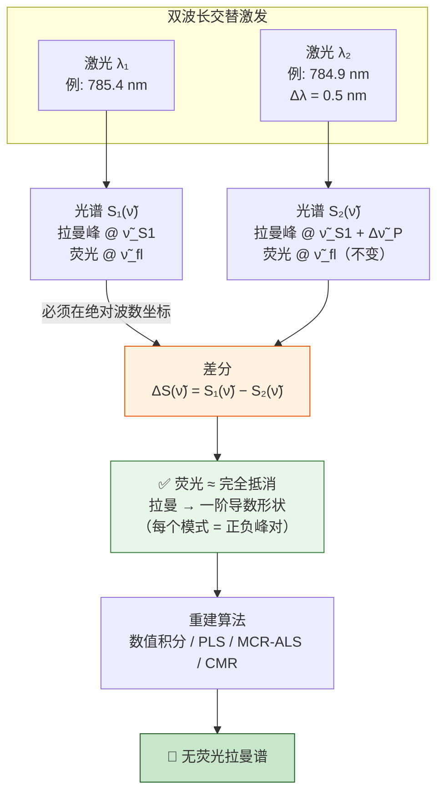
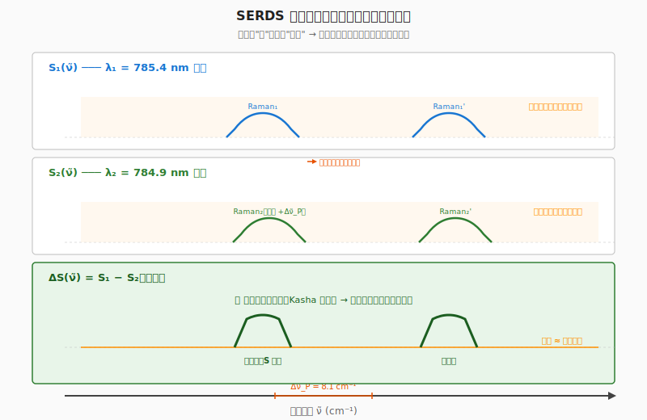
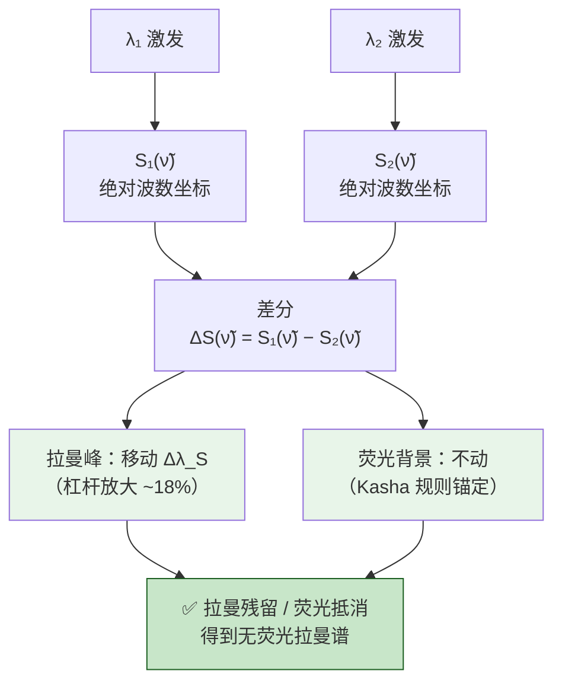
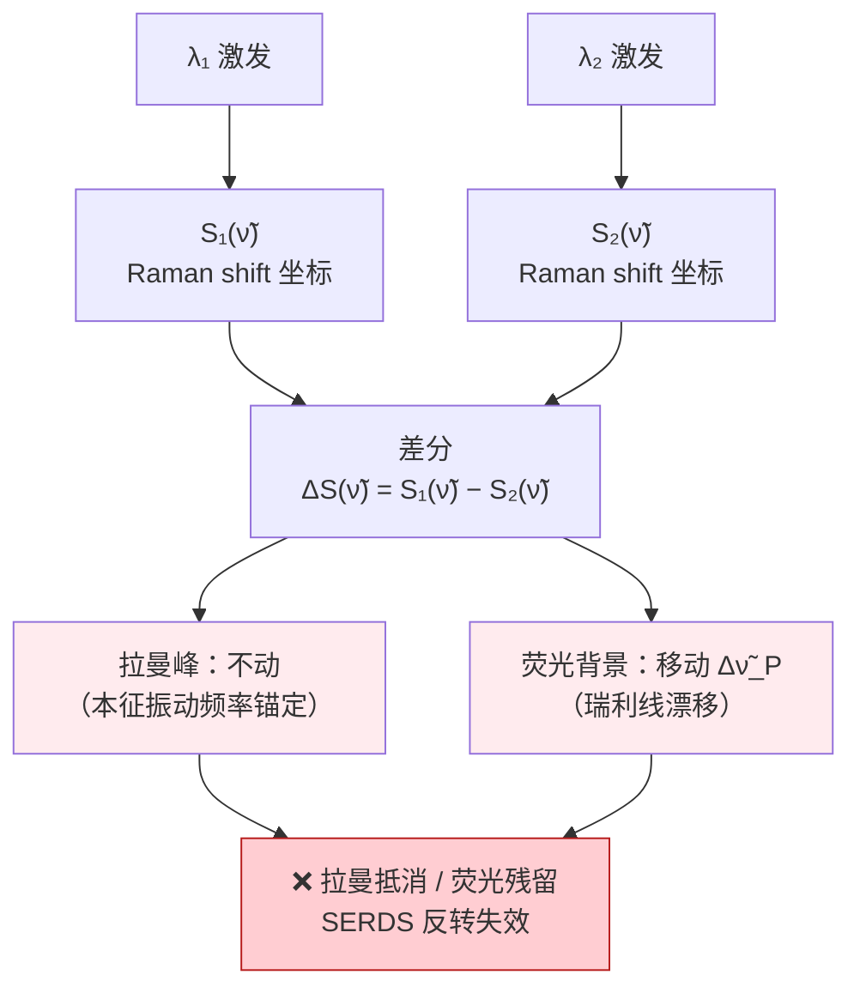

# 位移激发拉曼差分光谱（SERDS）技术简报

## 目录

1.  [一句话定义](#1-一句话定义)
2.  [术语 / 名词表](#2-术语--名词表)
3.  [核心技术原理](#3-核心技术原理)
4.  [原理示意图](#4-原理示意图)
5.  [基本公式方程](#5-基本公式方程)
6.  [技术变体 / 发展：交替激发的调制方式](#6-技术变体--发展交替激发的调制方式)
7.  [数据处理算法](#7-数据处理算法)
8.  [典型示例应用](#8-典型示例应用)
9.  [注意事项与工程要点](#9-注意事项与工程要点)
10. [参考文献](#10-参考文献)
11. [依赖地图](#11-依赖地图)

---

## 1. 一句话定义

> **位移激发拉曼差分光谱 (Shifted-Excitation Raman Difference Spectroscopy, SERDS)** 通过两个波长极近的激光交替激发样品，利用拉曼信号与荧光背景对激发波长微小变化的不同响应特性，在**绝对波数坐标**上做差分以消除荧光背景，同时保留拉曼信号。
>
> **英文名**：Shifted-Excitation Raman Difference Spectroscopy（SERDS）
>
> **典型应用场景**：强荧光背景样品（土壤、生物组织、药物、原油）的拉曼定量分析；本简报触发文献为土壤有机碳（SOC）定量（Analytical Chemistry 2025）。

拉曼光谱是分子"指纹"分析的有力工具，但实际应用中常受**荧光背景**严重干扰——荧光信号通常比拉曼信号强 $10^3$–$10^6$ 倍，可完全掩盖拉曼峰。

传统解决方案各有局限：

| 方案 | 原理 | 局限 |
|:---|:---|:---|
| 基线校正算法 | 多项式拟合 / ALS 扣基线 | 仅后处理，对强荧光无效 |
| 深层紫外激发（< 260 nm） | 避开荧光激发带 | 设备昂贵，紫外光损伤样品 |
| 时间门控检测 | 利用荧光寿命（ns）远长于拉曼散射（fs）的时间差 | 需皮秒脉冲激光器 + 时间门控探测器 |
| 近红外激发（> 1000 nm） | 降低荧光效率 | 拉曼散射截面也急剧下降（$\propto 1/\lambda^4$） |

**SERDS** 提供了一种**纯光学、无需脉冲光源、兼容常规 CCD 探测器**的荧光消除方案。

---

## 2. 术语 / 名词表

### 2.1 专有名词 + 公式物理量符号

**专有名词（名称 / 缩写）**：

| 术语 | 含义 | 首次出现章节 |
| :-: | :-- | :-- |
| **SERDS** | Shifted-Excitation Raman Difference Spectroscopy，位移激发拉曼差分光谱 | §3.1 / §3.2 |
| **Kasha 规则** | 荧光发射只从电子激发态最低振动能级发出（荧光不变性的物理根源） | §3.3 |
| **绝对波数坐标** | 以绝对波数（cm⁻¹）为横坐标的光谱坐标 | §3.2 / §2.3 |
| **Raman shift 坐标** | 以拉曼位移（cm⁻¹）为横坐标的光谱坐标（商用拉曼软件默认） | §3.2 |
| **SOC** | Soil Organic Carbon，土壤有机碳 | §8.1 |

**公式物理量符号**：

| 符号 | 含义 | 数值 / 常用取值 | 首次出现章节 |
|:---:|:---|:---|:---|
| $\lambda_P$ | 激发波长 | 785 nm 附近（典型） | §5.1 |
| $\lambda_S$ | Stokes 散射光波长 | 852 nm 附近（$\lambda_P$ = 785 nm, $\tilde\nu_\text{vib}$ = 1000 cm⁻¹） | §5.1 |
| $\tilde\nu_\text{vib}$ | 分子振动模式波数 | 200–3000 cm⁻¹（指纹区） | §5.1 |
| $\Delta\lambda_P$ | 双波长激发的波长差 | 0.3–1.2 nm（785 nm 下） | §5.3 |
| $\Delta\tilde\nu_P$ | 双波长激发的波数差 | 5–20 cm⁻¹（典型 8.1 cm⁻¹ @ $\lambda_P$ = 785 nm, $\Delta\lambda_P$ = 0.5 nm） | §5.3 |
| $\Delta\lambda_S$ | Stokes 波长位移 | ≈ $\Delta\lambda_P \cdot (\lambda_S/\lambda_P)^2$ | §5.4 |
| $S(\tilde\nu)$ | 绝对波数坐标上的光谱 | 含拉曼 $R$ + 荧光 $F$ + 噪声 $\varepsilon$ | §5.5 |
| $\Delta S(\tilde\nu)$ | SERDS 差分谱 | ≈ $\frac{dR}{d\tilde\nu} \cdot \Delta\tilde\nu_P$ | §5.5 |
| FWHM$_\text{Raman}$ | 拉曼峰的半高全宽 | 决定 $\Delta\lambda_P$ 上下限 | §5.6 |

### 2.2 同义术语与别名

| 术语 / 名词 | 别名 |
| :-: | :-- |
| **SERDS** | 位移激发拉曼差分光谱 / Shifted-Excitation Raman Difference Spectroscopy |
| **绝对波数坐标** | 绝对频率坐标 / 绝对波长坐标 / 绝对波长 / 绝对坐标（简称） |
| **Raman shift 坐标** | 拉曼位移 / 相对波数 |
| **Raman shift** | 拉曼位移 |

### 2.3 意思相近术语 + 分类标准歧义术语

| 术语对 / 单术语 | 区分说明 / 分类标准 |
|:---|:---|
| **绝对波数坐标 vs Raman shift 坐标** | 意思相近术语（同源但有明确区别）：差分需在**绝对波数坐标**做才能保留拉曼消除荧光；若误在 Raman shift 坐标做差分则反过来消掉拉曼（详见 §3.2 灵魂锚点"坐标对偶性"） |
| **拉曼信号 vs 荧光背景** | 意思相近术语（同源但有明确区别）：SERDS 差分的目的就是消除荧光背景保留拉曼信号；两者在 SERDS 双波长差分中表现完全相反（详见 §3.2 灵魂锚点） |
| **光子**（分类标准歧义术语） | 按起源分类：γ 射线 / X 射线 / 紫外 / 可见 / 红外；按能量分类：> 100 keV 区间 γ / X 兼有 |

---

## 3. 核心技术原理

### 3.1 技术背景

> 📖 **前置概念：荧光为什么与拉曼不同**
>
> 可先把两类信号理解成两条不同的能量路径：**拉曼散射**近似是光子与分子振动的瞬时能量交换，峰位由分子振动频率决定；**荧光**则是分子先真正吸收光、进入电子激发态，经过振动弛豫后再发光。Kasha 规则描述的正是后一条路径：分子通常先回到最低激发单重态的最低振动能级，再发生荧光发射。因此，微调激发波长时，拉曼峰与荧光背景在不同坐标系中的移动方式不同，这正是 SERDS 能做差分的前提（详见 §3.3）。

#### 拉曼光谱的本意

拉曼光谱是分子"指纹"分析的有力工具——每个分子的振动模式对应一组特征拉曼峰（cm⁻¹ 坐标），相当于分子身份证。**一句话好处**：无损、原位、成分定性的化学指纹，可用于固体 / 液体 / 生物样品的非破坏分析。

但这条 happy path 有一个巨大的现实障碍——**荧光背景**。荧光信号通常比拉曼信号强 $10^3$–$10^6$ 倍，可完全掩盖拉曼峰。强荧光样品（土壤、生物组织、药物、原油）的拉曼谱**实质上不可用**。

#### 传统荧光消除方案的局限

（详细对比表见 §1，传统方案有 4 类——基线校正 / 深层紫外 / 时间门控 / 近红外，各自局限在此不再重复。）

**根本问题**：传统方案要么靠硬件升级（贵 + 复杂），要么靠算法后处理（强荧光下失效）。**缺乏一种"纯光学 + 兼容常规 CCD"的荧光剥离手段**。

#### SERDS 的两条物理事实

SERDS 的核心洞察建立在两条独立的光物理事实上：

① **拉曼散射的相对位移是固定的**——由分子振动频率决定，不随激发波长微小变化而变；
② **荧光发射波长由 Kasha 规则锚定**——无论激发到哪个振动能级，分子都先经振动弛豫到 $S_1(v=0)$，再发射荧光——**与激发波长无关**。

**合取的推论**：在绝对波数坐标上做"两波长差分"——**拉曼峰移动、荧光不动**——荧光被天然抵消、拉曼以一阶导数形态残留。详见 §3.2 灵魂锚点的"坐标对偶性"拆解。

### 3.2 ★ 灵魂锚点：坐标对偶性

SERDS 的全部物理基础可凝练为一张表——**两种"不动"在对偶坐标里互换**：

| 坐标轴 | 拉曼峰 | 荧光背景 |
|:---:|:---:|:---:|
| **绝对波数坐标** | **移动** $\Delta\lambda_S \approx \Delta\lambda_P \cdot (\lambda_S/\lambda_P)^2$ | **不动**（Kasha 规则锚定） |
| **Raman shift (cm⁻¹)** | **不动**（分子本征振动频率锚定） | **移动** $\Delta\tilde{\nu}_P$（瑞利线漂移 → 相对位移变化） |

**关键推论**：SERDS 差分**必须在绝对波数坐标上进行**——因为只有在此坐标下，拉曼"动"而荧光"不动"，差分后荧光被抵消，拉曼以一阶导数形态残留。

> ⚠️ **工程踩坑**：商用拉曼光谱仪默认按 Raman shift 输出数据。直接在 Raman shift 坐标做差分会**反过来消掉拉曼、留下荧光**，与 SERDS 目的完全相反。
>
> **判据**：谁"不动"，谁就在差分中被消掉。SERDS 要保留拉曼，就必须选择"拉曼会动"的坐标——也就是**绝对波数坐标**。

### 3.3 Kasha 规则与荧光不变性

Kasha 规则指出：无论激发到电子激发态 $S_1$ 的哪个振动能级，分子都会先经**振动弛豫**（vibrational relaxation，ps 级）到达 $S_1$ 最低振动能级（$v=0$），再发射荧光。

因此，荧光发射波长仅取决于 $S_1(v=0) \to S_0(v')$ 的能级差，**与激发波长无关**。

当激发波长仅变化 $\sim 0.5$–$1$ nm 时，Kasha 规则极为严格地成立——荧光谱在绝对波数坐标上**理论上完全不变**。

> **少数例外**：多荧光物种混合、激发带边共振、红边效应等情况下，荧光形状可能有微弱激发波长依赖，在生物组织、原油等复杂样品中偶有报道。对大多数液相/固体药物分析可忽略。

### 3.4 差分原理

设两个激发波长 $\lambda_{P1}$、$\lambda_{P2}$（$|\Delta\lambda_P| < 1$ nm）分别产生光谱 $S_1(\tilde{\nu})$ 和 $S_2(\tilde{\nu})$（绝对波数坐标）：

$$S_i(\tilde{\nu}) = R_i(\tilde{\nu}) + F(\tilde{\nu}) + \varepsilon_i(\tilde{\nu})$$

- $R_i$：拉曼信号（峰位随激发波长移动）
- $F$：荧光背景（不随 $i$ 变化，Kasha 锚定）
- $\varepsilon_i$：噪声

在绝对波数坐标做差：

$$\Delta S(\tilde{\nu}) = S_1(\tilde{\nu}) - S_2(\tilde{\nu}) = \underbrace{[R_1(\tilde{\nu}) - R_2(\tilde{\nu})]}_{\text{拉曼残留}} + \underbrace{[F_1(\tilde{\nu}) - F_2(\tilde{\nu})]}_{\approx\, 0\;\text{(Kasha)}} + \underbrace{[\varepsilon_1 - \varepsilon_2]}_{\text{噪声}}$$

**荧光被天然抵消**，拉曼差值近似为其一阶导数：

$$\Delta S(\tilde{\nu}) \approx \frac{dR(\tilde{\nu})}{d\tilde{\nu}} \cdot \Delta\tilde{\nu}_P$$

差分谱中每个拉曼模式表现为一对**正负峰**（S 形曲线，类似导数谱）。

---

## 4. 原理示意图

### 4.1 SERDS 信号处理流程

### 4.2 谱图原理示意

### 4.3 坐标对偶性——为什么差分必须在绝对坐标做

**① 绝对波数坐标（✅ 正确做法）**

**② Raman shift 坐标（❌ 错误做法）**

**③ 两种坐标的差分行为对比**：

| 坐标 | 拉曼峰 | 荧光背景 | 差分结果 |
|:---|:---|:---|:---|
| **绝对波数坐标** | 移动 Δλ_S | 不动（Kasha 锚定） | ✅ 拉曼残留 / 荧光抵消 |
| **Raman shift 坐标** | 不动（本征振动频率） | 移动 Δν̃_P（瑞利线漂移） | ❌ 拉曼抵消 / 荧光残留 |

### 4.4 配套交互演示

🔗 直接打开：`交互演示.html`（浏览器双击即可，零依赖）

包含 4 个面板的交互演示：
- **(a) 绝对波数坐标**：拉曼移、荧光不动
- **(b) Raman shift 坐标**：拉曼不动、荧光移
- **(c) 绝对坐标差分**：拉曼残留 ✅（正确做法，绿色面板）
- **(d) Raman shift 差分**：荧光残留 ❌（错误做法，红色面板）

**可调参数**：Δλ（激发波长差）、荧光强度、荧光中心、荧光宽度、噪声水平（5 个滑块）

配色：✅ 正确 = 暖绿，❌ 错误 = 暖红，与本简报正反对照表呼应（按 §二 "围绕核心洞察设计对比视图" 规范）。

---

## 5. 基本公式方程

### 5.1 拉曼散射基本关系

斯托克斯 Raman shift（分子振动模式的本征频率）：

$$\tilde{\nu}_{\text{shift}} = \frac{1}{\lambda_P} - \frac{1}{\lambda_S} = \tilde{\nu}_{\text{vib}}$$

- $\lambda_P$：激发波长（cm）
- $\lambda_S$：斯托克斯散射光波长（cm）
- $\tilde{\nu}_{\text{vib}}$：分子振动模式波数（cm⁻¹），**本征属性，不随激发波长变化**

> **适用条件**：斯托克斯位移远小于激发波数（$|\tilde{\nu}_\text{vib}| \ll 1/\lambda_P$）时近似成立；近共振 / 反斯托克斯区时需考虑更高阶修正。

### 5.2 斯托克斯散射波长

$$\lambda_S = \frac{1}{\dfrac{1}{\lambda_P} - \tilde{\nu}_{\text{vib}}}$$

> **适用条件**：$\tilde{\nu}_\text{vib}$ 与 $1/\lambda_P$ 同号且数值小于 $1/\lambda_P$（斯托克斯情形）。

### 5.3 双波长激发的波数位移

$$\Delta\tilde{\nu}_P = \left|\frac{1}{\lambda_{P1}} - \frac{1}{\lambda_{P2}}\right| = \frac{|\Delta\lambda_P|}{\lambda_P^2}$$

> **数值例子**：$\lambda_P = 785$ nm，$\Delta\lambda_P = 0.5$ nm
>
> $$\Delta\tilde{\nu}_P = \frac{0.5 \;\text{nm}}{(785 \;\text{nm})^2} \approx 8.1 \;\text{cm}^{-1}$$
>
> **适用条件**：当 $|\Delta\lambda_P| \ll \lambda_P$ 时成立（典型 $|\Delta\lambda_P| / \lambda_P < 1\%$）。

### 5.4 斯托克斯波长的杠杆系数

对 $\lambda_S = (1/\lambda_P - \tilde{\nu}_{\text{vib}})^{-1}$ 关于 $\lambda_P$ 求导：

$$\boxed{\frac{d\lambda_S}{d\lambda_P} = \left(\frac{\lambda_S}{\lambda_P}\right)^2}$$

因此斯托克斯波长的位移：

$$\Delta\lambda_S = \Delta\lambda_P \cdot \left(\frac{\lambda_S}{\lambda_P}\right)^2$$

> **数值例子**：$\lambda_P = 785$ nm，$\tilde{\nu}_{\text{vib}} = 1000$ cm⁻¹
>
> | 量 | 值 |
> |:---|:---|
> | $\lambda_S$ | $851.9$ nm |
> | 杠杆系数 $(\lambda_S/\lambda_P)^2$ | $\approx 1.18$ |
> | $\Delta\lambda_P = 0.5$ nm → $\Delta\lambda_S$ | $\approx 0.59$ nm |
>
> **物理意义**：拉曼峰在绝对波数坐标的移动量略大于激发波长变化（杠杆放大 ~18%），且**与分子种类无关**——只取决于激发波长和振动模式位置。
>
> **适用条件**：在 $|\Delta\lambda_P| \ll \lambda_P$ 区间为线性近似。

### 5.5 SERDS 差分信号

绝对波数坐标上两光谱之差：

$$\Delta S(\tilde{\nu}) = S_1(\tilde{\nu}) - S_2(\tilde{\nu}) = \underbrace{[R_1(\tilde{\nu}) - R_2(\tilde{\nu})]}_{\text{拉曼残留}} + \underbrace{\left[F(\tilde{\nu}) - F(\tilde{\nu})\right]}_{\approx\; 0\;\text{(Kasha)}}$$

当 $\Delta\tilde{\nu}_P$ 远小于拉曼峰宽时，拉曼差值可近似为一阶导数：

$$\Delta S(\tilde{\nu}) \approx \frac{dR(\tilde{\nu})}{d\tilde{\nu}} \cdot \Delta\tilde{\nu}_P$$

> **适用条件**：小位移近似 $\Delta\tilde{\nu}_P \ll \text{FWHM}_\text{Raman}$ 时差分近似导数；Kasha 锚定要求荧光弛豫时间 ≪ 两次采样的时间间隔。

### 5.6 Δλ_P 的选取条件

$$\text{FWHM}_{\text{Raman, min}} \;<\; \Delta\tilde{\nu}_P \;<\; \text{FWHM}_{\text{Raman, max}}$$

| 约束 | 原因 |
|:---|:---|
| 下限：$\Delta\tilde{\nu}_P >$ 最窄拉曼峰 FWHM | 否则差分信号过弱，信噪比下降 |
| 上限：$\Delta\tilde{\nu}_P <$ 拉曼峰间距 | 否则相邻峰的一阶导数对发生混叠 |

- 典型范围：$5$–$20$ cm⁻¹（对应 785 nm 下约 $0.3$–$1.2$ nm）
- 文献常用值：$\Delta\lambda_P \approx 0.3$–$0.7$ nm（785 nm 激发）

> **适用条件**：先以单波长扫一张谱，确认峰宽后再选 $\Delta\lambda_P$——选大了混叠，选小了 SNR 崩。

---

## 6. 技术变体 / 发展：交替激发的调制方式

> SERDS 的"变体"主要在 **如何在两波长间切换**，不同切换方式决定了切换频率、可移植性、成本。

| 调制方式 | 切换频率 | 单波长驻留时间 | 典型应用场景 |
|:---:|:---:|:---:|:---|
| 机械切换（滤光片轮 / 斩波器） | 1–100 Hz | 5–500 ms | 早期验证、低速离线分析 |
| 可调谐 LD（电流 / 温度调谐） | 100 Hz–10 kHz | 50 µs–5 ms | 现代台式 SERDS 主流 |
| 声光调制器 AOM / 电光调制器 EOM | 10 kHz–10 MHz | 50 ns–50 µs | 高速在线、原位、便携 |
| DMD 数字微镜阵列 | kHz 级 | µs 级 | 多波长并行（拓展型） |

**物理约束**：

| 约束 | 原因 |
|:---|:---|
| 频率下限 | 需快于激光功率漂移、样品移动、温度漂移的时间尺度（~10 ms 量级） |
| 频率上限 | 受探测器读出速率（CCD 慢，SPAD/EMCCD 快）和电子学带宽限制 |
| 占空比 | 通常 50:50 对称；少数系统插入关光时段做暗背景扣除（33:33:33） |

> **适用条件 / 选型提示**：CCD 测弱荧光样品 → LD 调谐即可；便携 / 现场 → AOM 或 EOM；多通道并行 → DMD。无单一"最优"方案，需根据样品 + 仪器约束协同选择。

---

## 7. 数据处理算法

差分谱 $\Delta S(\tilde{\nu})$ 是一阶导数形状（正负峰对），需进一步处理才能还原为"类常规拉曼谱"形态：

| 算法 | 原理 | 优势 | 适用场景 |
|:---|:---|:---|:---|
| **数值积分** | 对 $\Delta S$ 做定积分还原类谱图 | 简单、快速 | 单组分、峰分离好 |
| **ALS-SERDS** | 先对 $\lambda_1$、$\lambda_2$ 各做非对称最小二乘基线扣除，再差分 | 进一步压制残余荧光 | 多组分、常规定量 |
| **Common Mode Rejection (CMR)** | 小波分解多尺度提取两波长的"公共模式"（= 荧光）并剔除 | 非参数化、鲁棒 | 复杂基质、强荧光 |
| **PCA / PLS** | 训练集建立差分谱 ↔ 浓度的回归模型 | 定量精度高、可多组分同时预测 | 定量分析、在线监测 |
| **MCR-ALS** | 非负约束 + 交替最小二乘分解 $\Delta S$ 为基谱 × 浓度 | 物理可解释、保留光谱形态 | 多组分重叠谱 |

---

## 8. 典型示例应用

### 8.1 【本简报触发文献】土壤有机碳（SOC）定量分析

- **文献**：*Quantification of Soil Organic Carbon by Shifted-Excitation Raman Difference Spectroscopy with Machine Learning and Common Mode Rejection.* **Analytical Chemistry, 2025.**
- **链接 / DOI**：<https://pubs.acs.org/doi/10.1021/acs.analchem.5c06692>（DOI: 10.1021/acs.analchem.5c06692，开放获取 CC-BY）

**★ 用到本技术 / 变体的具体位置**：
1. **§3 核心技术原理**：用 Kasha 锚定 + 双波长坐标差分的物理思路（SERDS 的"坐标对偶性"是该论文的隐式基础）。
2. **§6 调制方式**：采用 LD 电流调谐实现 ≈100 Hz 切换（对应 §6 表中"现代台式 SERDS 主流"档位）。
3. **§7 数据处理算法**：本文核心创新是 **CMR-SERDS**（Common Mode Rejection）——在 §7 表中对应 CMR 算法，本文给出具体的多分辨率小波实现（七层 bior1.3 分解 + 各层共模剔除）。
4. **§5 公式选取**：取 Δλ = 0.5 nm（对应 Δν̃_P ≈ 8.1 cm⁻¹），与 §5.6 的典型范围一致。
5. **§9 注意事项**：样品层面覆盖了"§9 多荧光物种"约束——土壤矿物 + 有机质的复杂基质正是 CMR-SERDS 的设计目标。

- **关键发现**：
  1. SERDS 成功消除土壤强荧光背景，暴露出石英（464 cm⁻¹）、方解石（1086 cm⁻¹）和有机碳的拉曼特征。
  2. **SOC 含量升高 → 拉曼信号强度呈非线性衰减**（有机碳的光吸收特性抑制了背散射光）——这一现象在合成混合物实验中得到验证。
  3. CMR-SERDS 在处理非线性光学效应方面优于 ALS-SERDS。
  4. 机器学习（PLS 回归）在 CMR-SERDS 谱上的 SOC 预测精度显著优于常规拉曼。

### 8.2 仪器配置 / 样品集

| 配置项 | 值 |
|:---|:---|
| 双激光波长 | $\lambda_1 = 785.4$ nm，$\lambda_2 = 784.9$ nm |
| 波长差 $\Delta\lambda$ | $0.5$ nm（$\Delta\tilde{\nu}_P \approx 8.1$ cm⁻¹） |
| 光谱范围 | 200–3000 cm⁻¹ |
| 积分时间 | ≤ 150 ms / 光谱 |
| 激光功率 | ≤ 25 mW |
| 采样策略 | 10 × 10 网格 × 100 次重复（$\lambda_1$、$\lambda_2$ 交替） |
| 探测器 | CCD（Wasatch Photonics WP 785X ILC OEM） |
| 波长稳定性监控 | 聚苯乙烯标准样定期校准 |

**样品集**：
- 400 份农田土壤（SOC 范围 0.28–5.7 wt%，燃烧法测定真值）
- 200 份合成矿物-有机混合物（石英 + 方解石 + 木炭 + 堆肥，SOC 0–7 wt%）
- 100 份 KNO₃ 内标添加土壤（用于评估 SOC 对拉曼强度的非线性衰减）

---

## 9. 注意事项与工程要点

### 9.1 缺点 / 弱项 / 不足 / 局限束缚

- **必须修改商用拉曼软件的默认数据流程**：默认 Raman shift 输出会导致差分失效，需改用绝对波数坐标（见 §9.2 第 1 条）。
- **Δλ_P 选取有边界**：太小会降低信噪比，太大会造成导数峰对混叠（见 §5.6）。
- **差分谱是导数形状**：需要进一步采用积分 / CMR / MCR-ALS 等算法，还原为类常规拉曼谱，结果依赖算法选择。
- **多荧光物种时假设可能被破坏**：激发带边共振 / 红边效应会破坏 Kasha 假设（见 §3.3 的少数例外）。

### 9.2 踩坑框

| # | 要点 | 说明 |
|:---:|:---|:---|
| 1 | **坐标系选择** | 差分**必须**在绝对波数坐标进行；不能直接用商用谱仪默认的 Raman shift 坐标相减（见 §3.2 灵魂锚点） |
| 2 | **Δλ_P 选取** | 略大于最宽拉曼峰的 FWHM（典型 0.3–1.2 nm @785 nm）；需先用单波长扫一张确认峰宽（见 §5.6） |
| 3 | **功率均衡** | 两波长功率差 ≤ 1%，否则功率波动混入差分信号，误判为"拉曼信号" |
| 4 | **光斑重合** | 两波长照明必须严格共线，否则差分结果混入"样品空间差异"而非"激发波长差异" |
| 5 | **波长稳定性** | 建议用聚苯乙烯标准样在测量前后各校准一次，监控 $\lambda_1$、$\lambda_2$ 漂移 |
| 6 | **探测器匹配** | CCD 适合切换频率 ≤ kHz；SPAD / EMCCD 适合 MHz 级切换（见 §6 表） |
| 7 | **多荧光物种** | 若样品含多个荧光物种且各自吸收带不同，$\lambda_1$、$\lambda_2$ 可能激发不同比例 → 差分后残留弱荧光形状变化，需 PLS / MCR-ALS 二次处理 |

> ⚠️ **常见反模式**：
> - ❌ 直接用商用拉曼软件对 Raman shift 输出做差分——这会消掉拉曼、留下荧光（见 §3.2 灵魂锚点）
> - ❌ 上来就加大 Δλ 想"更快消荧光"——会让相邻导数峰对混叠
> - ❌ 忽略功率均衡 / 波长稳定性监控——会把仪器漂移误判为拉曼信号

---

## 10. 参考文献

> 标注 `（待核实）` / `（待补充）` / `（作者 / 卷期页本次未核实）` 的条目，是凭已有信息列出但本次未直接核对的字段——请审核时按需检索 / 补充。

**经典文献（按时间正序）**：

1. Shreve 等早期 SERDS 工作（具体出处待补充）**（待核实）**

**综述**：

2. Cooper 等在线过程监测综述（具体出处待补充）**（待核实）**

**应用论文（按依赖强度排序；本简报触发的用户文献排第一条）**：

3. **Quantification of Soil Organic Carbon by Shifted-Excitation Raman Difference Spectroscopy with Machine Learning and Common Mode Rejection.** *Anal. Chem.* **2025**. DOI: 10.1021/acs.analchem.5c06692 **（作者 / 卷期页本次未核实）**

**应用扩展（药物 / 食品 / 环境 / 等，建议后续按需增补）**：

- 药物分析应用：待补充
- 食品 / 农产品：待补充

> **待补充清单（审核时请按需检索并补全）**：
> 1. SERDS 原始提出文献（Shreve 等早期工作）
> 2. 在线过程监测综述（Cooper 等）
> 3. 药物 / 食品 / 环境领域的典型应用各 2-3 篇

---

## 11. 依赖地图

| 依赖强度 | 技术 | 在 A 中的角色 | 是否需要独立简报 |
|:---|:---|:---|:---|
| 🔴 强依赖 | **拉曼光谱基础**（Stokes / ν⁴ 律 / Kasha 规则） | 信号产生机理 + 荧光不变性来源 | ⚠️ **待询问** |
| 🟡 弱依赖 | **化学计量学算法包**（PCA / PLS / MCR-ALS / CMR） | 差分后的还原工具（§7） | 否 |
| 🟡 弱依赖 | **可调谐激光器 / 切换器件**（LD 调谐 / AOM / EOM） | §6 调制方式的工程实现 | 否 |
| ⚪ 仅提及 | 标准拉曼谱仪硬件（CCD / 光谱仪 / 光纤） | 工具引用 | 否 |
| ⚪ 仅提及 | 聚苯乙烯 / 标准样品（用于波长稳定性监控） | 工具引用 | 否 |

> 本简报在 **§3.2 坐标对偶性** 和 **§3.3 Kasha 规则** 处强依赖 **拉曼光谱基础**，但未在本文展开。
> 
> 是否需要我（CherryClaw）单独撰写一份"拉曼光谱基础"技术简报？
> 
> （如需，请确认侧重方向：基础原理 / 工程实践 / 文献综述 / ICH-style 方法学）
> 
> ⚠️ 拉曼光谱基础的更深依赖（如"分子振动基础"）将在依赖技术的简报里再展开。
