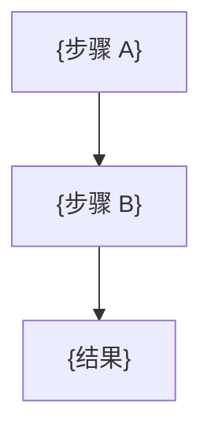

# {技术名称}技术简报

## 目录

1.  [一句话定义](#1-一句话定义)
2.  [核心技术原理](#2-核心技术原理)
3.  [原理示意图](#3-原理示意图)
4.  [基本公式方程](#4-基本公式方程)
5.  [技术变体 / 发展](#5-技术变体--发展可选)
6.  [数据处理算法](#6-数据处理算法可选)
7.  [典型示例应用](#7-典型示例应用)
8.  [注意事项与工程要点](#8-注意事项与工程要点)
9.  [参考文献](#9-参考文献)
10. [依赖地图](#10-依赖地图)

---

## 1. 一句话定义

> **{技术名}** = {用一句话说清楚是什么、做什么}
>
> **英文名**：{English name}（{aliases}）
>
> **典型应用场景**：{一两个最常见的应用领域，1-2 句话}

---

## 2. 核心技术原理

### 术语表

| 术语 | 简单释义 | 备注 |
| :-: | :-- | :-- |
| **{术语 A}** | {术语的一句话释义} | 别名：{别名 1} / {别名 2} —— 同义术语，正文严禁别名混用 |
| **{术语 B}** | - | 意思相近术语：**与 {术语 C} 的区分** —— {明确区分说明} |
| **{术语 C}** | - | 分类标准歧义术语：按 {标准 A} 分类：{归类}；按 {标准 B} 分类：{归类} |

### 2.1 技术背景

> {前置概念}

#### {Happy path}

#### {Fail / 反直觉}

#### {Fix / 解法}

### 2.2 ★ 灵魂锚点

| 关键要素 1 | 关键要素 2 | 关键推论 |
|:---:|:---:|:---:|
| ... | ... | ... |

### 2.3 {子原理 A}

{分层 / 分链拆解；可含多张对比表}

### 2.4 {子原理 B}

{……}

---

## 3. 原理示意图

### 3.1 流程图（Mermaid）

### 3.2 几何 / 谱图示意（外部 SVG）

### 3.3 配套交互演示（可选，但推荐）

🔗 直接打开：`交互演示.html`（浏览器双击即可，零依赖）

---

## 4. 基本公式方程

### 4.1 {公式名称}

$$
\boxed{\text{公式}}
$$

- **符号说明**：
  - $x$：含义（量纲）
  - $y$：含义（量纲）

- **数值例子**：代入 {典型参数} → 结果 = {具体数字}

- **适用条件**：{公式成立的前提/边界}（如：瑞利区适用 / Mie 区仅作机理理解）

### 4.2 {公式名称 2}

{……}

---

## 5. 技术变体 / 发展（可选）

| 变体类型 | 核心差异 | 适用场景 | 与主体的关系 |
|:---|:---|:---|:---|
| {变体 A} | ... | ... | ... |
| {变体 B} | ... | ... | ... |

---

## 6. 数据处理算法（可选）

| 算法 | 原理 | 优势 | 适用场景 |
|:---|:---|:---|:---|
| {……} | {……} | {……} | {……} |

---

## 7. 典型示例应用

### 7.1 【本简报触发文献】{用途简述}

- **文献**：{作者}. {标题}. {期刊} **{年份}**, **{卷(期)}**, {页}.
- **链接 / DOI**：[{URL}]({URL})（DOI: `{DOI}`，开放获取/受限）

**用到本技术 / 变体的具体位置**：
1. {在本技术体系中，这篇论文用到了哪部分——精确到段落/章节/图号级别}
2. {……}
3. {……}

- **意义 / 可借鉴点**：{一句话总结为何值得引用，以及其它研究者如何借鉴}

### 7.2 {其它典型应用（可选）}

| 应用 | 该技术发挥的作用 |
|:---|:---|
| ... | ... |

---

## 8. 注意事项与工程要点

### 8.1 缺点 / 弱项 / 不足 / 局限束缚

- {缺点 1}
- {缺点 2}
- {缺点 3}

### 8.2 踩坑框

| # | 要点 | 说明 |
|:---:|:---|:---|
| 1 | {踩坑 1} | {踩坑原因 + 规避方式} |
| 2 | {踩坑 2} | {……} |
| 3 | {踩坑 3} | {……} |

> ⚠️ **常见反模式**：
> - ❌ {反模式 1}
> - ❌ {反模式 2}

---

## 9. 参考文献

**经典文献（按时间正序）**：

1. {Author A; Author B. *Title.* Journal Year, Vol(Issue), Pages.} DOI: {DOI}
2. {……}

**综述**：

3. {Author X. *Review title.* Journal Year.} DOI: {DOI}
4. {……}

**应用论文（按依赖强度排序）**：

5. {User-provided paper for this brief.} DOI: {DOI}

---

## 10. 依赖地图

| 依赖强度 | 技术 | 在 A 中的角色 | 是否需要独立简报 |
|:---|:---|:---|:---|
| 🔴 强依赖 | {拉曼光谱基础 等} | {信号产生机理 等} | {⚠️ 待询问 / 否} |
| 🟡 弱依赖 | {LSPR 等} | {增强机理引用 等} | {否} |
| ⚪ 仅提及 | {电化学工作站 等} | {工具引用 等} | {否} |

> {补充备注}
